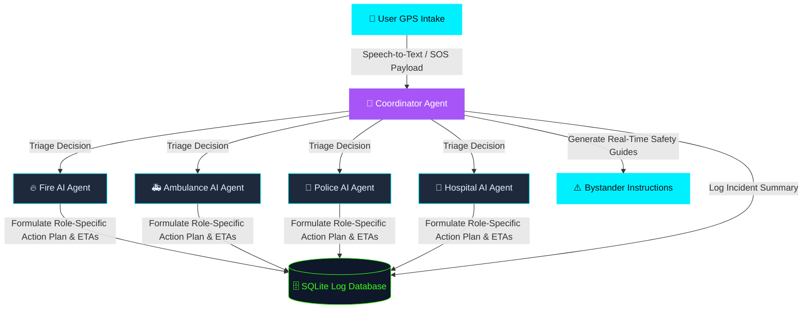
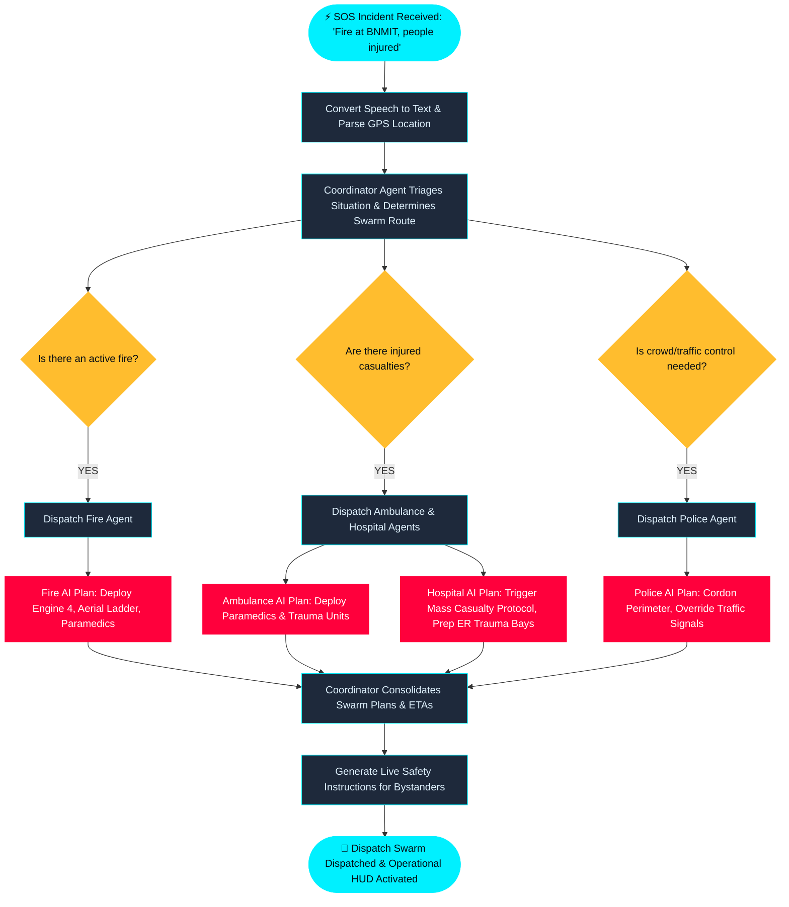

# RespondAI — Multi-Agent Emergency Triage & Dispatch System

RespondAI is an autonomous, decentralized multi-agent emergency response swarm designed to triage, orchestrate, and dispatch resources in real-time during critical incidents. It leverages Gemini-powered cognitive intelligence to coordinate local responders (Ambulance, Hospital, Police, and Fire) via a unified command center interface.

---

## 📌 The Problem

In emergency response systems (911 dispatch, disaster relief), seconds save lives. However, legacy systems suffer from:
1. **Manual Triage Latency:** Dispatchers must manually assess reports, leading to bottlenecks during multi-casualty incidents.
2. **Resource Fragmentation:** Medical, fire, and police agencies operate on siloed communication channels, delaying coordination.
3. **Information Asymmetry:** First responders often navigate to scenes without real-time, consolidated context regarding patient status or hazards.

---

## 💡 The Solution

RespondAI solves this by introducing a **decentralized, parallelized multi-agent cognitive swarm**:
* **Parallel Dispatch:** Within milliseconds of receiving a situation report (via text or voice), our Coordinator Agent determines the hazard severity and concurrently dispatches all required logistics agents.
* **Autonomous Decision-Making:** Each field agent (Ambulance, Hospital, Police, Fire) runs its own cognitive model to dynamically formulate custom action plans, establish staging locations, and calculate ETAs based on the emergency context.
* **Interactive Overwatch:** A high-fidelity, real-time dashboard visualizes the data packets moving between agents, giving supervisors total operational clarity.

---

## 🛠️ System Architecture

RespondAI utilizes a directed workflow graph built on Google's ADK (Agent Development Kit) framework to orchestrate real-time response:



---

## 📊 Logical Flow Chart

Below is the logical flow diagram representing the decision-making logic and routing execution for a concrete emergency scenario (e.g., *“Fire at college, people are injured and trapped”*):



1. **Intake & Triage:** The coordinator parses the input text/speech and identifies the severity and incident types (Mixed: Fire + Medical).
2. **Dynamic Routing:** Parallel nodes are triggered in the graph execution to allocate tasks to relevant departments.
3. **Execution Plan:** Each department calculates its individual ETA and action plan, returning a unified command sheet back to the supervisor dashboard.

---

## 📦 Tech Stack

* **Backend:** FastAPI (Python), Google GenAI SDK (`gemini-2.5-flash`)
* **Frontend:** Glassmorphism UI (Vanilla HTML5/CSS3/JavaScript)
* **Environment Manager:** `uv` (Fast Python packaging)
* **Database:** SQLite (Stores audit logs and exported CSV incident reports for Kaggle validation)

---

## 🏃 Run Locally

### 1. Prerequisites
Ensure you have `uv` installed. If you don't, install it via:
```bash
powershell -ExecutionPolicy ByPass -c "irm https://astral.sh/uv/install.ps1 | iex"
```

### 2. Environment Setup
Configure your Google Gemini API key:
Create a `.env` file in the root directory:
```env
GEMINI_API_KEY="your_api_key_here"
```

### 3. Start the Swarm

Run the preconfigured batch script to start both the FastAPI backend and static frontend server simultaneously:
```bash
./run_all.bat
```

Alternatively, launch them in separate terminals:

**Backend:**
```bash
uv run python app/fast_api_app.py
```

**Frontend:**
```bash
python -m http.server 3000 --directory frontend
```

Open your browser and navigate to **http://localhost:3000** to use the Command Center dashboard.
