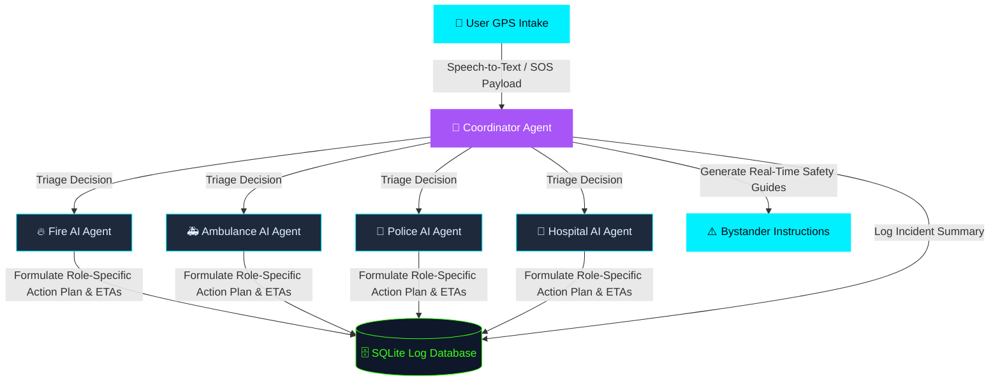

# RespondAI — Multi-Agent Emergency Triage & Dispatch System

RespondAI is an autonomous, decentralized multi-agent emergency response swarm designed to triage, orchestrate, and dispatch resources in real-time during critical incidents. It leverages Gemini-powered cognitive intelligence to coordinate local responders (Ambulance, Hospital, Police, and Fire) via a unified command center interface.

---

## 🚀 Key Features

* **Multi-Agent Orchestration:** Uses a central Coordinator Agent to parse emergency intake reports and dynamically route task payloads to specialized domain agents (Fire, Police, EMS, and Hospital).
* **Neural Swarm Visualizer:** A high-tech frontend interface built with SVG/CSS that illustrates real-time data packets traveling between agents as they communicate and resolve tasks.
* **Role-Specific POVs:** Dynamic mini-consoles that update instantly from each agent's perspective (e.g., showing the route/ETA on the Ambulance dash, or ER readiness state on the Hospital terminal).
* **Live Speech-to-Text Intake:** Integrated Web Speech API support that transcribes voice emergencies in real-time, giving dispatchers a hands-free HUD.
* **High-Performance Infrastructure:** Powered by FastAPI, Google GenAI SDK, and managed with `uv` for lightning-fast python environments.

---

## 🛠️ System Architecture

RespondAI utilizes a directed workflow graph built on Google's ADK (Agent Development Kit) framework to orchestrate real-time response:



1. **Intake / GPS Node:** captures location coordinates and audio descriptions.
2. **Coordinator Agent:** dynamically processes the report, classifies emergency type/severity, and routes assignments.
3. **Logistics Swarm:** Fire, Ambulance, Police, and Hospital agents autonomously generate situational action plans and estimate ETAs using Gemini.

---

## 📦 Tech Stack

* **Backend:** FastAPI (Python), Google GenAI SDK (`gemini-2.5-flash`)
* **Frontend:** Glassmorphism UI (Vanilla HTML5/CSS3/JavaScript)
* **Environment Manager:** `uv` (Fast Python packaging)
* **Database:** SQLite (Stores audit logs and exported CSV incident reports)

---

## 🏃 Run Locally

### 1. Prerequisites
Ensure you have `uv` installed. If you don't, install it via:
```bash
powershell -ExecutionPolicy ByPass -c "irm https://astral.sh/uv/install.ps1 | iex"
```

### 2. Environment Setup
Configure your Google Gemini API key:
Create a `.env` file in the root directory:
```env
GEMINI_API_KEY="your_api_key_here"
```

### 3. Start the Swarm

Run the preconfigured batch script to start both the FastAPI backend and static frontend server simultaneously:
```bash
./run_all.bat
```

Alternatively, launch them in separate terminals:

**Backend:**
```bash
uv run python app/fast_api_app.py
```

**Frontend:**
```bash
python -m http.server 3000 --directory frontend
```

Open your browser and navigate to **http://localhost:3000** to use the Command Center dashboard.
