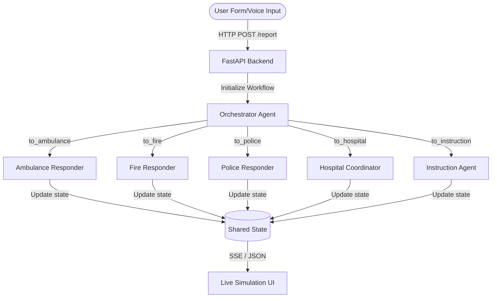
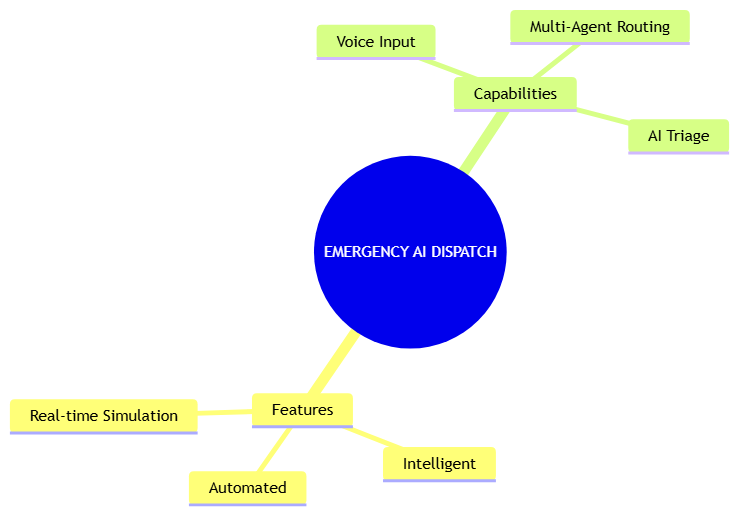
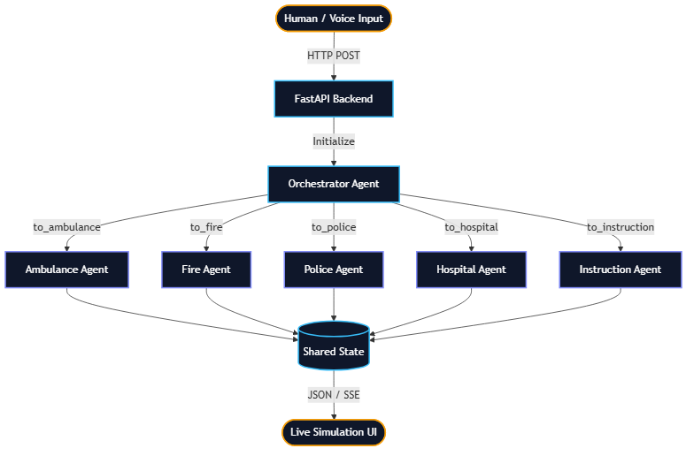

# Emergency AI Response System 🚨
An intelligent, real-time multi-agent triage and dispatch system powered by Gemini.

## Prerequisites
- Python 3.11+
- `uv` (Fast Python package installer and resolver)
- Gemini API key (Get it from [aistudio.google.com/apikey](https://aistudio.google.com/apikey))

## Quick Start

```bash
# 1. Clone the repository
git clone <your-repo-url>
cd emergency-response

# 2. Set up environment variables
# Create a .env file and add your API key:
echo "GEMINI_API_KEY=your_key_here" > .env
echo "GOOGLE_GENAI_USE_VERTEXAI=False" >> .env

# 3. Install dependencies using uv
uv sync

# 4. Start the backend server
uv run python app/fast_api_app.py

# 5. Open the frontend (you can use any static server or double-click the HTML file)
# Example using python's built-in http server:
cd frontend
python -m http.server 3000
```
Open `http://localhost:3000` in your web browser.

## Architecture 



## How to Run
- **Web App**: Run `uv run python app/fast_api_app.py` for the backend, and serve the `frontend/` directory to test the live voice and simulation dashboard.
- **Data Export**: Visit `http://localhost:8000/export` to download the Kaggle-ready CSV dataset of logged emergencies.

## Sample Test Cases

### Test Case 1: Severe Medical Emergency
- **Input**: "My father just collapsed, he is clutching his chest and not breathing properly!"
- **Expected**: Orchestrator assigns HIGH severity and MEDICAL type. Routes to Ambulance, Hospital, and Instruction agents. 
- **Check**: The UI simulation will show Ambulance and Hospital units dispatching, and the Live Instructions will tell the user to perform CPR.

### Test Case 2: Multi-Agency Incident
- **Input**: "There's a massive car crash on Highway 9, one of the cars is on fire and people are trapped."
- **Expected**: Orchestrator assigns HIGH severity and MIXED type. Routes to Ambulance, Fire, Police, and Hospital.
- **Check**: The timeline will show Fire units (for extraction and putting out the fire), Police (for traffic control), and Ambulances dispatching simultaneously.

### Test Case 3: Minor Nuisance
- **Input**: "My neighbor is playing very loud music and it's 2 AM."
- **Expected**: Orchestrator assigns LOW severity and POLICE type.
- **Check**: Only the Police agent responds (low priority dispatch), and Instructions recommend staying inside and waiting for a noise complaint officer.

## Troubleshooting

1. **"Network Error" on Submit**
   - *Fix*: Ensure the FastAPI backend is actually running on port 8000. Run `uv run python app/fast_api_app.py`.
2. **AI Dispatcher returns 503 Service Unavailable**
   - *Fix*: The Gemini free tier might be rate-limited. Wait 1 minute and try again, or ensure you are using the `gemini-2.5-flash-lite` model in `agent.py` which has higher limits.
3. **Microphone icon doesn't work**
   - *Fix*: Ensure you are accessing the frontend via `localhost` or HTTPS. Browsers block microphone access on raw `file:///` URLs.

## Push to GitHub

1. Create a new repo at https://github.com/new
   - Name: `emergency-response`
   - Visibility: Public or Private
   - Do NOT initialize with README (you already have one)

2. In your terminal, navigate into your project folder:
   ```bash
   cd emergency-response
   git init
   git add .
   git commit -m "Initial commit: emergency-response ADK agent"
   git branch -M main
   git remote add origin https://github.com/<your-username>/emergency-response.git
   git push -u origin main
   ```

3. Verify `.gitignore` includes:
   `.env`          ← your API key — must NEVER be pushed
   `.venv/`
   `__pycache__/`
   `*.pyc`
   `.adk/`

⚠ NEVER push `.env` to GitHub. Your API key will be exposed publicly.

## Assets

### Cover Banner


### Architecture Diagram


## Demo Script

[Presentation Script](DEMO_SCRIPT.txt)
