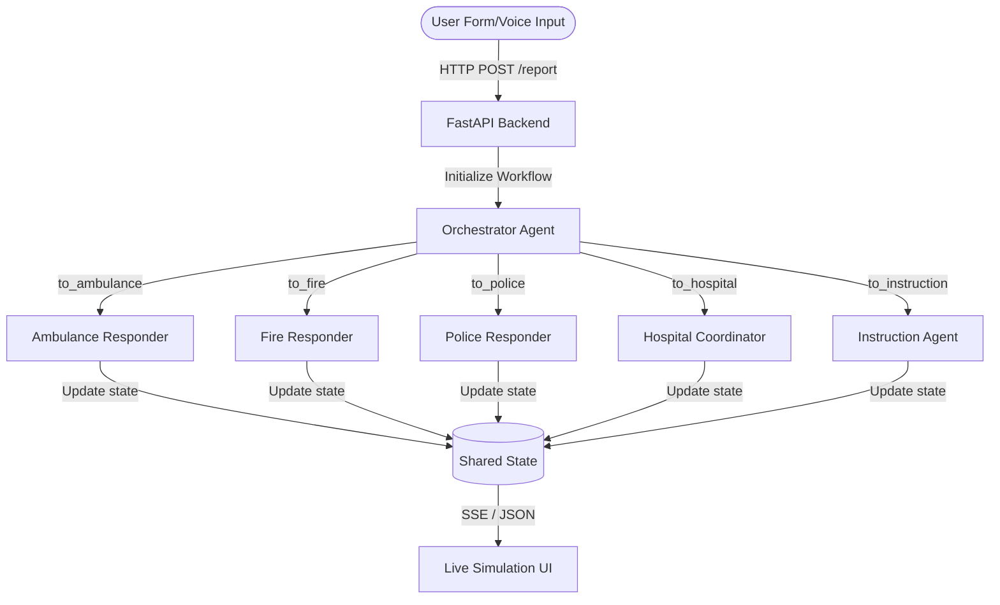

# AI Emergency Triage & Dispatch Agent 🚨

## Problem Statement
When emergencies occur, seconds matter. Traditional 911 dispatch relies heavily on human operators who can become overwhelmed during major incidents (e.g., natural disasters, mass casualty events), leading to delayed response times. Furthermore, while callers wait for help, they often lack critical, real-time safety instructions.

This project solves this by introducing a **Multi-Agent AI Dispatcher**. It instantly triages incoming emergency reports, parallelizes dispatching across multiple specialized agencies (Police, Fire, Ambulance, Hospital), and simultaneously provides the caller with life-saving first-aid instructions—significantly reducing response latency.

## Solution Architecture
The solution uses a multi-agent workflow powered by Gemini 2.5 Flash Lite and the Google ADK, exposed through a FastAPI backend and a live simulation frontend.

## Concepts Used
- **ADK Workflow & Graph Routing:** Instead of a single LLM trying to do everything, the `Orchestrator` determines the *severity* and *emergency type*, then dynamically routes to multiple `ResponderAgent` nodes in parallel using `Edge` routing.
- **Shared State Management (`ctx.state`):** As multiple agents process the incident simultaneously, they write their estimated time of arrivals (ETAs) and actions back to a central `ctx.state`, which allows the backend to collect all outputs without conflict.
- **LlmAgents with Structured JSON:** Each node strictly enforces a JSON response schema (`TriageDecision`, `ResponderAction`, `InstructionPlan`) ensuring that the AI outputs can be directly parsed and presented by the UI without messy parsing logic.
- **Data Export & Persistence:** A SQLite database layer (`fast_api_app.py`) logs every single dispatch and allows downloading the entire operational history as a CSV for analytics and compliance (accessible via the `/export` endpoint).

## HITL Flow (Human-In-The-Loop)
While the AI processes dispatch rapidly, the human caller remains directly in the loop. The frontend uses the **Web Speech API** to allow voice transcription of their emergency in real-time. Crucially, the newly added `InstructionAgent` closes the loop by sending actionable, situational first-aid or safety instructions back to the human on the screen while they wait.

## Demo Walkthrough
To test the system:
1. Navigate to the web app interface (`localhost:3000`).
2. Click the 🎤 Microphone button and speak an emergency (e.g., "I've been in a car crash on the highway and my arm is bleeding!").
3. Submit the report.
4. The timeline will simulate the dispatch: First, the Orchestrator classifies it as HIGH severity and MEDICAL. Next, the Ambulance and Hospital agents announce their dispatch with estimated ETAs. Finally, the Instruction Agent flashes a warning box telling the user to "Apply pressure to the wound" and "Stay in the vehicle if safe."

## Impact / Value Statement
By automating the initial intake and triage, this system could allow human dispatchers to focus entirely on complex edge cases and emotional support for callers, rather than data entry. The addition of the real-time Instruction Agent brings an immediate layer of active safety to the caller, effectively starting the "treatment" phase before the physical ambulance even arrives.
